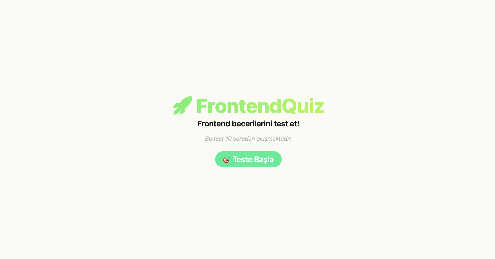
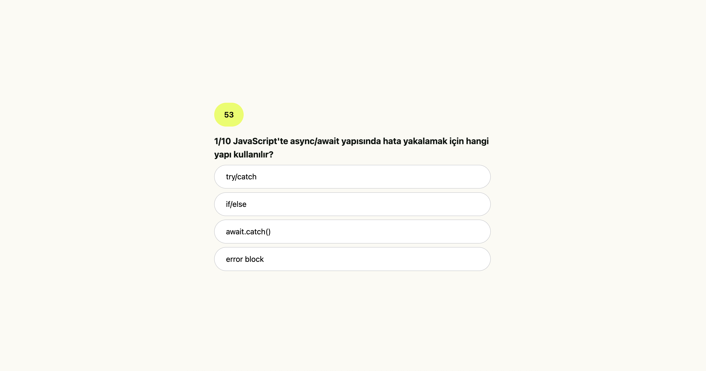
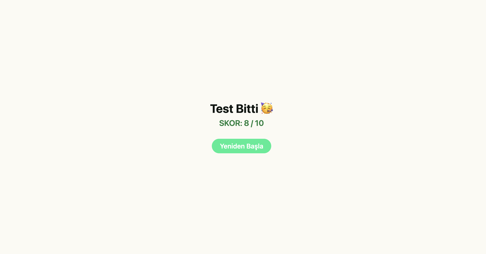

# FrontendQuiz

FrontendQuiz, temel frontend bilgilerini test etmek için hazırlanmış 10 soruluk eğlenceli ve interaktif bir quiz uygulamasıdır. React ve TypeScript kullanılarak geliştirilmiştir.

## 🚀 Özellikler

- 📋 10 soruluk frontend testi
- 🌀 Sorular ve şıklar her seferinde rastgele karıştırılır
- ⏱ Her soru için 60 saniyelik zamanlayıcı
- ✅ Doğru / ❌ Yanlış seçeneği tıklanınca anında görsel geri bildirim
- 📊 Skor ekranı ile sonuç gösterimi
- 🌈 Responsive ve modern kullanıcı arayüzü (Tailwind CSS ile)
- 🎨 Soft renk paleti ve dikkat çekici açılış ekranı

## 🛠 Teknolojiler

- React
- TypeScript
- Tailwind CSS
- Vite

## 📸 Ekran Görüntüsü

 Açılış ekranı  


 Soru ekranı  


 Skor ekranı  


## ⚙️ Kurulum

1. Bu projeyi klonlayın:
   ```bash
   git clone <https://github.com/busracogul/quiz-app.git>
   cd quiz-app
   ```
2. Bağımlılıkları yükleyin:
   ```bash
   npm install
   ```
3. Geliştirme sunucusunu başlatın:
   ```bash
   npm run dev
   ```
4. Uygulamayı tarayıcınızda görüntüleyin:
   ```bash
   http://localhost:5173
   ```
